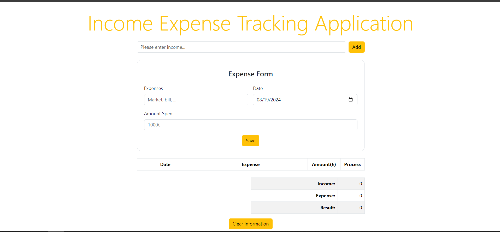

# Income and Expense Tracker Application

This project is a simple web application that allows you to track your income and expenses. Income is stored using local storage, while expenses are only stored in memory and are reset when the page is refreshed.

## Features

- **Add Income:** Users can add multiple sources of income, which are saved in local storage.
- **Add Expense:** Users can track their expenses by filling out the expense form. Expenses are stored in memory until the page is refreshed.
- **Track Income and Expenses:** Users can view the total income, total expenses, and the remaining balance.
- **Delete Expenses:** Each item in the expense list can be deleted individually.
- **Reset Income and Expenses:** Users can reset the application by clearing all income and expense data.

## Installation

1. Clone or download the project.
2. Run the files using any web browser on a local server.

## Usage

- **Add Income:** Enter an amount in the income input field and click the "Add" button.
- **Add Expense:** Fill in the expense area, date, and amount, then click the "Add" button.
- **Delete Expenses:** Click the trash can icon in the expense table to delete the corresponding expense.
- **Reset Data:** Click the "Clear" button to reset all income and expense data.

## Technical Details

- **LocalStorage Usage:** Income information is saved in local storage, so data is preserved even when the page is refreshed.
- **Dynamic DOM Manipulation:** The expense list and results are updated dynamically with JavaScript.
- **Event Listeners:** The application responds to form submissions and button clicks using various event listeners.

## Preview

## Demo

You can view the live demo of the project here: [Live Demo](https://okan87.github.io/Income-Expense-Tracking-Application/)
